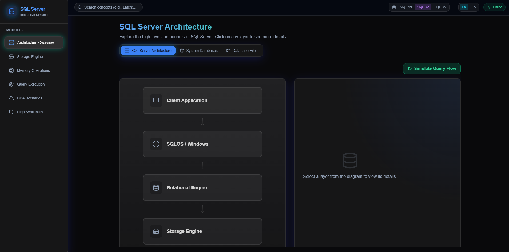

# SQL Server Architecture Simulator 🚀

An advanced, interactive educational platform designed to demystify the internal complexities of Microsoft SQL Server. Built with modern web technologies, this simulator provides a deep-dive into how the engine handles data, memory, and execution at a granular level.

🌍 **Live Demo:** [sqllab.dev](https://sqllab.dev/)

---

## 🎯 Core Mission

The **SQL Server Architecture Simulator** bridges the gap between abstract database theory and real-world DBA production scenarios. It is designed for engineers who want to visualize what happens "under the hood" when a query is executed, a page splits, or an Availability Group fails over.

---

## 🧩 Deep Dive: Interactive Modules

The simulator is organized into specialized modules, each focusing on a critical subsystem of the SQL Server engine:

### 1. Relational Engine (The Brain)
*   **Query Pipeline**: Visualize the journey of a T-SQL statement through Parsing, Binding, and Optimization.
*   **Query Optimizer**: Understand how the Cost-Based Optimizer (CBO) evaluates different execution plans.
*   **Execution**: Real-time visualization of query execution phases and operator behavior.

### 2. SQLOS (The heart of the Engine)
*   **Scheduling**: Watch how the SQLOS Scheduler manages Workers, Yielding, and Quantum usage.
*   **Memory Clerks**: Explore how memory is subdivided among different engine components.
*   **Wait Statistics**: Interactive dashboard showing how resource contention translates into wait types (RESOURCE_SEMAPHORE, SOS_SCHEDULER_YIELD, etc.).

### 3. Storage Engine (The Foundation)
*   **B-Tree Internals**: Visualize Root, Intermediate, and Leaf levels of Clustered and Non-Clustered indexes.
*   **Page Architecture**: Interactive breakdown of 8KB pages, including Slot Arrays and Page Headers.
*   **Space Management**: Experience GAM, SGAM, and PFS allocation maps in action.
*   **Modern Features**: Simulation of Instant File Initialization (IFI) and its impact on performance.

### 4. Memory Manager
*   **Buffer Pool**: See how pages move between disk and memory via the LRU (Least Recently Used) policy.
*   **Plan Cache**: Understand plan reuse and the impact of ad-hoc vs. prepared queries.
*   **Memory Grants**: Visualize how workspace memory is allocated for Sort and Hash operations.

### 5. DBA Scenarios & T-SQL Suite
*   **Real-World Troubleshooting**: Interactive simulations of Page Splits, Deadlocks, and Blocking.
*   **Integrated Diagnostics**: Access a library of version-specific T-SQL scripts (SQL 2019 - 2025) used by senior DBAs to diagnose production issues.

---

## 🛠️ Technology Stack & Architecture

This project leverages a high-performance frontend stack to ensure smooth animations and complex state management:

- **React 19 & TypeScript**: Type-safe component architecture.
- **Framer Motion**: Powering the high-fidelity micro-animations for data flow and engine state transitions.
- **Tailwind CSS**: A sleek, dark-mode focused "Glassmorphism" UI that feels like a modern NOC dashboard.
- **Zustand / Context API**: Robust state management for cross-module interactions.

---

## 🚀 Roadmap

We are constantly expanding the simulator with new deep-dive features:

- [ ] **Hekaton Internals**: Visualizing In-Memory OLTP and MVCC.
- [ ] **Columnstore Deep Dive**: Delta Stores, Compressed Rowgroups, and Segment Elimination.
- [ ] **Query Store Visualization**: Tracking plan regressions over time.
- [ ] **Transaction Log Internals**: VLF management and log truncation visualization.

---

## 📦 Getting Started

### Prerequisites
- Node.js (v18+)
- `npm` or `yarn`

### Installation
1. `git clone https://github.com/ericsuarez/SQLWebsite.git`
2. `cd SQLWebsite`
3. `npm install`
4. `npm run dev`

---

## 📝 License
This project is licensed under the MIT License - see the [LICENSE](LICENSE) file for details.
